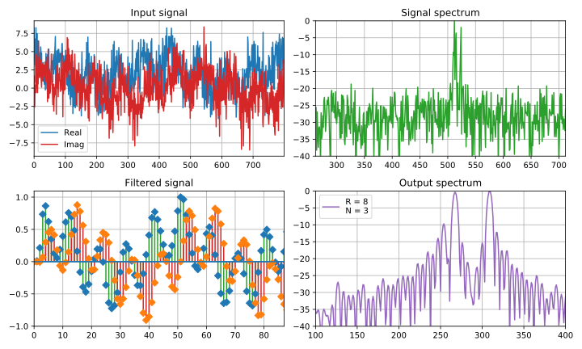

# Цифровая обработка сигналов

Проект содержит интерактивные материалы в виде законченных лекций по **цифровой обработке сигналов** (ЦОС) в виде тетрадок Jupyter Notebook. Это мои заметки по теоретическим аспектам и практическому применению задач ЦОС.  

Материалы представлены с использованием библиотек на языке *Python* (numpy , scipy, matplotlib, seaborn etc). Основная информация взята из **моих лекций**, которые я, будучи аспирантом, читал студентам Московского Энергетического Института (НИУ МЭИ). Частично информация из этих лекций была использована на обучающих лекциях в Центре Современной Электроники, где я выступал в качестве лектора. Кроме того, в эти лекции входит перевод различных статей, компиляция материалов из достоверных источников и литературы по тематике цифровой обработки сигналов, а также официальная документация по прикладным пакетам и встроенным функциям библиотек scipy и numpy языка **Python**.  

Большая часть обучающего материала для наглядного и интерактивного представления реализована с использованием *Jupyter Notebook*.  

*В зависимости от наличия свободного времени этот проект будет развиваться и постепенно наполняться новыми материалами по инициативе автора (то есть меня)*.  

### Общая информация 

| **Title**     | Digital signal processing |
| :-- | :-- |
| **Author**    | Alexander Kapitanov       |
| **Language**  | Python                    |
| **Contact**   | sallador@bk.ru            |
| **Release**   | 10 Jul 2019               |
| **License**   | GNU GPL 3.0               |

### [Список лекций](https://github.com/capitanov/dsp-theory/tree/master/src "DSP courses")

- [Сигналы: аналоговые, дискретные, цифровые. Z-преобразование](https://github.com/capitanov/dsp-theory/blob/master/src/dsp_theory_1_signals.ipynb "Signals, analog, digital, Z-transform"),
- [Преобразование Фурье: амплитудный и фазовый сигнала, ДПФ и БПФ](https://github.com/capitanov/dsp-theory/blob/master/src/dsp_theory_2_spectrum.ipynb "Discrete Fourier Transform. FFT, IFFT"),
- [Свертка и корреляция. Линейная и циклическая свертка. Быстрая свёртка](https://github.com/capitanov/dsp-theory/blob/master/src/dsp_theory_3_convolution.ipynb "Correlation, convolution: linear / circular / fast")
- [Случайные процессы. Белый шум. Функция плотности вероятностей](https://github.com/capitanov/dsp-theory/blob/master/src/dsp_theory_4_random_noise.ipynb "Random signals AWGN, Noise")
- [Детерминированные сигналы. Модуляция: АМ, ЧМ, ФМ, ЛЧМ. Манипуляция](https://github.com/capitanov/dsp-theory/blob/master/src/dsp_theory_5_modulation.ipynb "Modulation. AM-, FM-, Chirp signals")
- [Фильтрация сигналов: БИХ, КИХ фильтры](https://github.com/capitanov/dsp-theory/blob/master/src/dsp_theory_6_iir_fir_filters.ipynb "IIR / FIR filters")
- [Оконная фильтрация. Детектирование слабых сигналов с помощью наложения окна](https://github.com/capitanov/dsp-theory/blob/master/src/dsp_theory_7_windows.ipynb "Windows, filtration: Hann, Blackman, Flattop, Kaiser etc."), 
- [Ресемплинг: децимация и интерполяция. CIC-фильтры, фильтры скользящего среднего](https://github.com/capitanov/dsp-theory/blob/master/src/dsp_theory_8_resampling.ipynb "CIC filters, decimation, interpolation, moving average")
- [Непараметрические методы спектрального анализа](https://github.com/capitanov/dsp-theory/blob/master/src/dsp_theory_9_periodogram.ipynb "Spectrum analysis: Welch's Method")
- [Полифазные схемы преобразования Фурье - усреднение по частоте и по времени](https://github.com/capitanov/dsp-theory/blob/master/src/dsp_theory_10_polyphase_ffts.ipynb "Spectrum analysis: average spectrum")

## Зависимости

| **Requirements** |
| :-- |
| `jupyter`        |
| `matplotlib`     |
| `seaborn`        |
| `scipy`          |
| `numpy`          |

### TODO

- Wavelet analysis
- Audio analysis: Mel-spectrogram, griffin-lim algorithm, etc.

P.S. Спасибо за внимание, следите за развитием проекта!

### Link
  * https://habr.com/users/capitanov/
  
### Authors:
  * Kapitanov Alexander
  * Vladimir Fadeev
  
### Release:
  * 2019/07/10.

### License:
  * GNU GPL 3.0.
